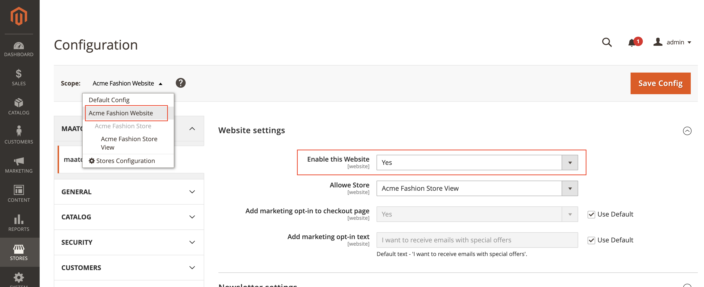

# maatoo for Magento 2

# Prerequisites

In order to run maatoo for Magento 2, the following components are required:
* PHP 7.4 or newer
* Magento 2.3 or Magento 2.4

This extensions has been tested on Magento Community Edition only. Please reach out to [support@maatoo.io](mailto:support@maatoo.io) if you'd like to run it on Adobe Commerce Cloud

# Installation

##  Install extension

To install the maatoo extension code base in Magento 2, use composer:
```
composer require maatoo/mto-magento2 --no-update
```

For more information and detailed instructions, refer to the official Adobe documentation:
https://experienceleague.adobe.com/docs/commerce-operations/installation-guide/tutorials/extensions.html

## Activate Extension 

Make sure to backup your installation (database and files). Also we highly recommend to test the extension on a staging or development instance first, and validate if the store checkout has no unexpected behaviour.

To activate to extension, run the following commands (adjust to your normal procedure if needed):

```
bin/magento maintenance:enable
bin/magento module:enable Maatoo_Maatoo
bin/magento setup:upgrade
bin/magento setup:di:compile
bin/magento setup:static-content:deploy -f
bin/magento maintenance:disable
```

## Configuration
After the extension is installed and activated, continue with the configuration.

### Basic Configuration
1. Open Magento Backend and go to maatoo -> Configuration
2. Make sure the «Default Config» scope is selected
3. Change «Enable this Solution» to «Yes»
4. Enter the Maatoo URL, User and Password provided from the maatoo team
5. Click «Save»
6. Switch to your website scope and change «Enable this Website» to «Yes»:  
7. Repeat step 6 for every website where the extensions should be activated

### Advanced Configuration
tbd

### Enable Persisent Carts
maatoo can send abandoned cart reminders. It's required to enable persistent cart in Magento so that online shoppers can recover their abandoned carts after clicking the e-mail reminder.
To enable persisent cart, perform these actions:
1. Go to General -> Web in Magento 2 Admin Panel
2. Go to Customers -> Persistent Shopping Cart
3. Set «Enable Persistence» to «Yes»
4. Save & Clear Caches

## Update Extension

Make sure to backup your installation. Also it's recommended to test the updated extension on a staging or development instance.

To update the extension, use composer:

```
composer update maatoo/mto-magento2
```

And then refresh Magento:
```
bin/magento maintenance:enable
bin/magento setup:upgrade
bin/magento setup:di:compile
bin/magento setup:static-content:deploy -f
bin/magento maintenance:disable
```
